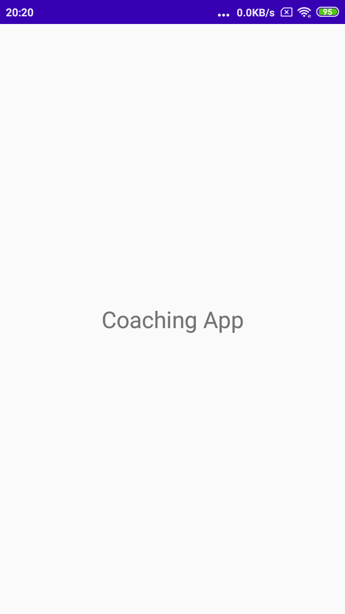
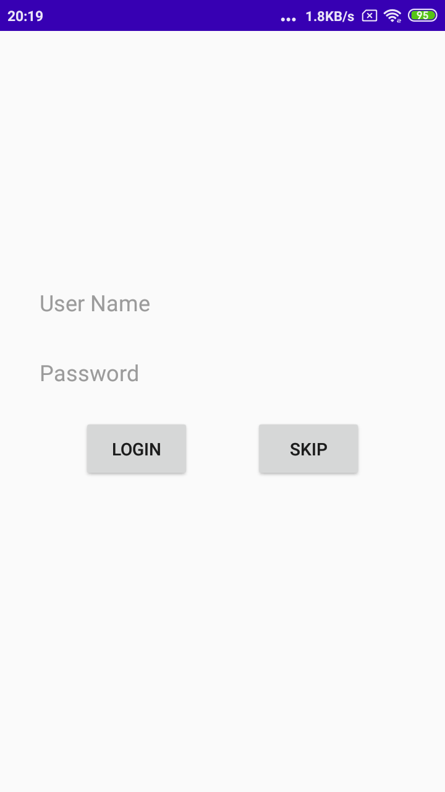
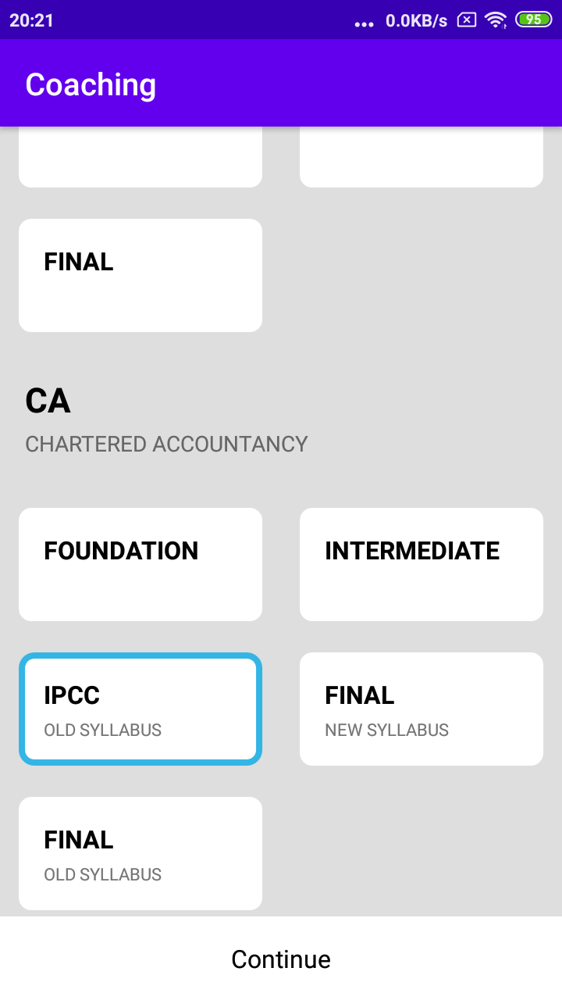
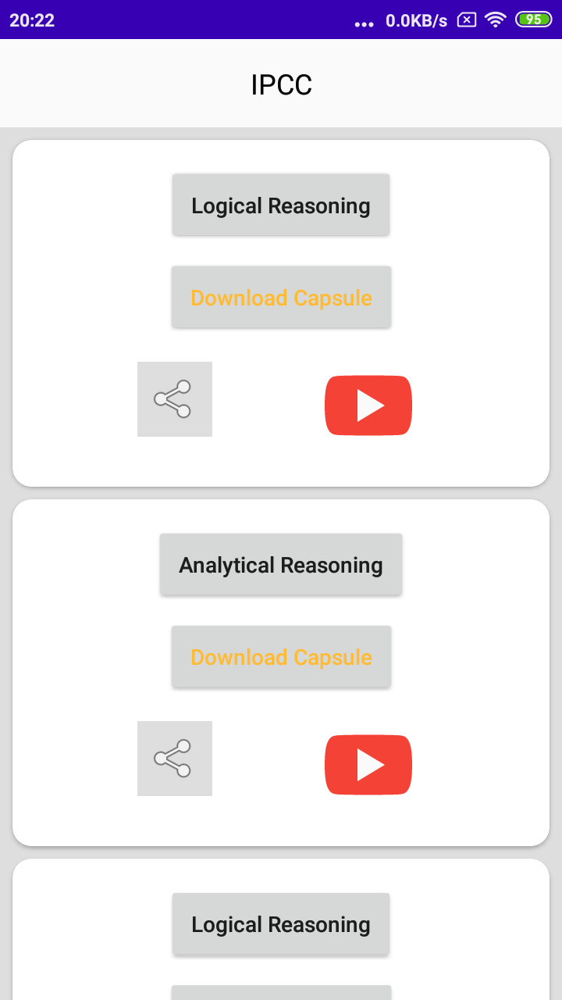
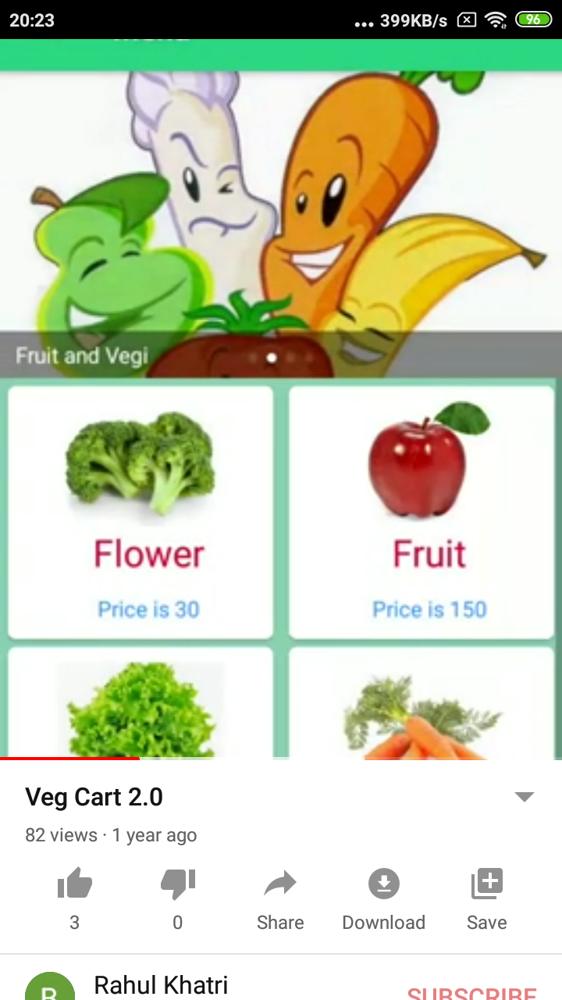

Nulurn Task
-----
### App Specifications:

- Kotlin 100% code.
- [Volley](https://developer.android.com/training/volley) : volley is used as networking library.
- [Shimmer Facebook library](https://github.com/facebook/shimmer-android): Showing progress like layout.

### App Packages:

- *activity:* all activity of project.

- *adapter:* Course Activity adapter.

- *model:* all model class of project.

- *utils:* files which can be used in entire project.

### Apk

- [Release apk](APK/NulurnTask.apk)

### Screenshot :

<table>
  <tr>
    <td>
      
    </td>
    <td>
      
    </td>
    <td>
      
    </td>
  </tr>
</table>

<table>
  <tr>
    <td>
      
    </td>
    <td>
      
    </td>
    <td>
      
    </td>
  </tr>
</table>

### Credits:

- Icon by: Icons made by <a href="https://www.flaticon.com/authors/pixel-perfect" title="Pixel perfect">Pixel perfect</a> from <a href="https://www.flaticon.com/" title="Flaticon"> www.flaticon.com</a>